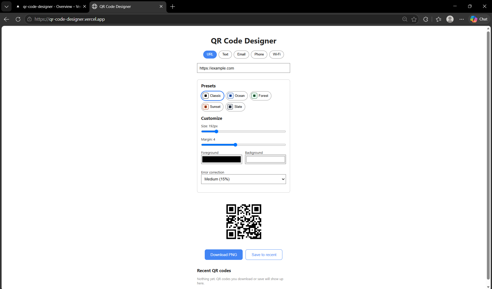
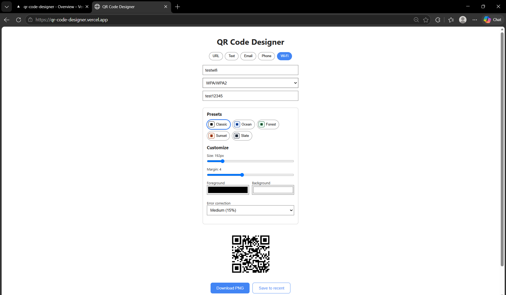
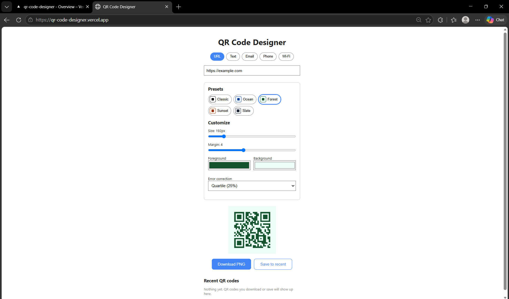
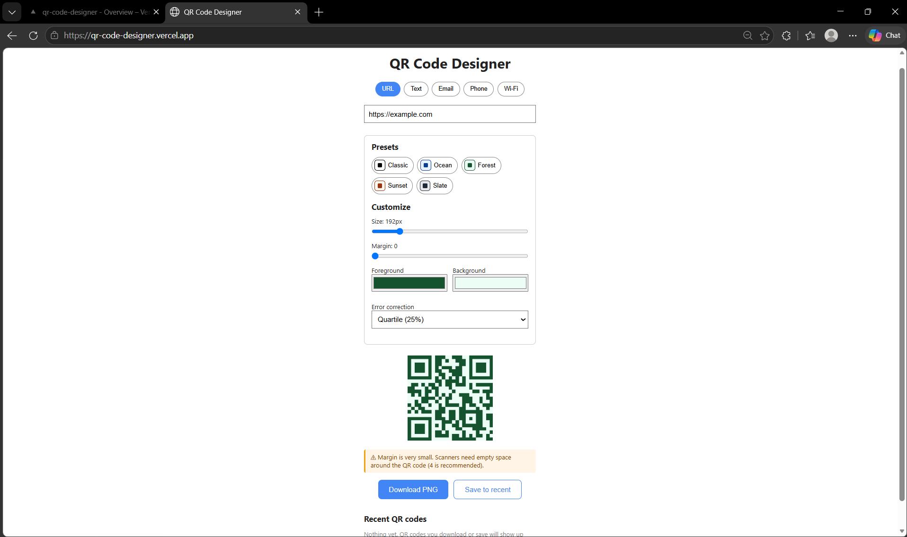
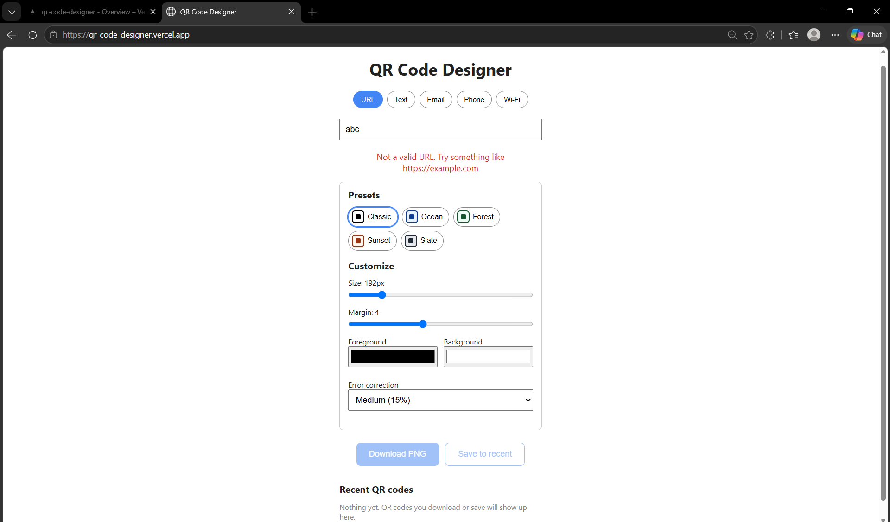
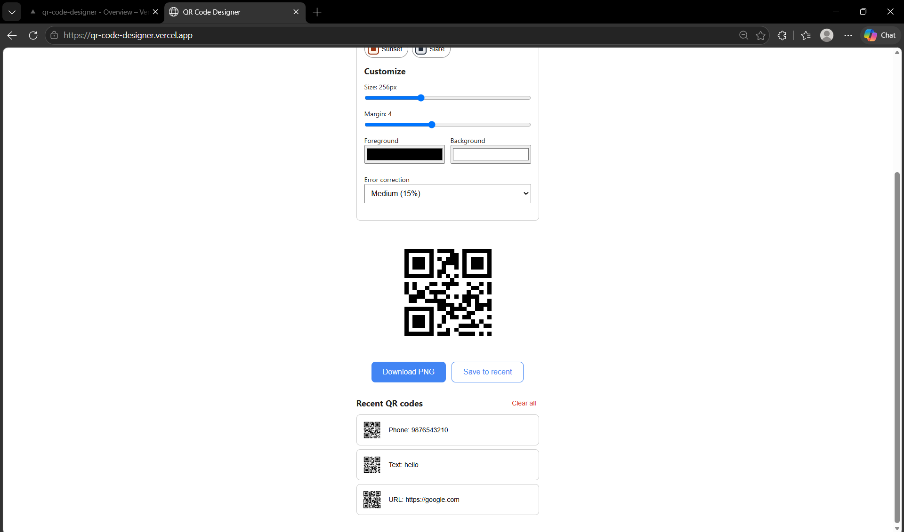
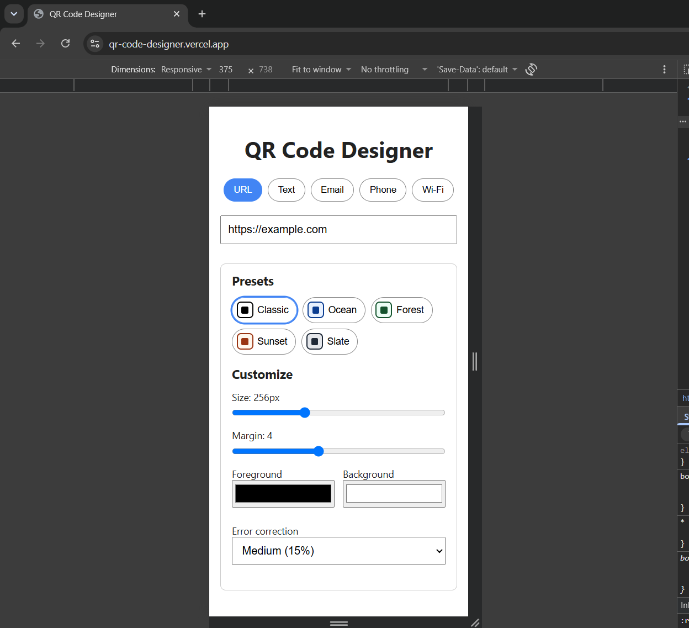

# QR Code Designer

A browser-based web app to generate, customize and download QR codes. Everything runs in the browser, so no backend is required.

**Live demo:** https://qr-code-designer.vercel.app  
**GitHub:** https://github.com/arya-codez/qr-code-designer  
**Built for:** GDG on Campus SRM Recruitments 2026-27 (Frontend, Task 1)

## Screenshots

| Desktop | Wi-Fi QR |
| --- | --- |
|  |  |

| Preset | Readability warning |
| --- | --- |
|  |  |

| Validation | Recent codes |
| --- | --- |
|  |  |

| Mobile |
| --- |
|  |

## Features

- **Five QR types:** URL, Plain Text, Email, Phone, and Wi-Fi. The input fields change based on the selected type.
- **Real-time preview:** the QR code updates whenever the input or customization settings change.
- **Customization:** size, margin, foreground color, background color, and error correction level (L, M, Q, H).
- **Presets:** five ready-made styles (Classic, Ocean, Forest, Sunset, and Slate). Presets only set the starting appearance, and the settings can still be changed afterwards.
- **PNG download:** the QR code can be downloaded as a PNG using the same canvas shown in the preview.
- **Validation:** invalid or incomplete input shows an error message and disables downloading.
- **Scan reliability warnings:** the app warns about low contrast, inverted colors, very small margins, small QR sizes, and very long content.
- **Recent QR codes:** the last 10 generated QR codes are stored in `localStorage` and can be reused after refreshing the page.
- **Responsive design:** the interface adapts to smaller screens and mobile devices.

## Tech Stack

- React with Vite
- JavaScript
- Plain CSS
- [`qrcode`](https://www.npmjs.com/package/qrcode) library for generating QR codes on a canvas
- Vercel for deployment

## Run Locally

```bash
git clone https://github.com/arya-codez/qr-code-designer.git
cd qr-code-designer
npm install
npm run dev